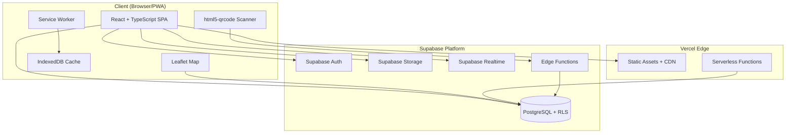
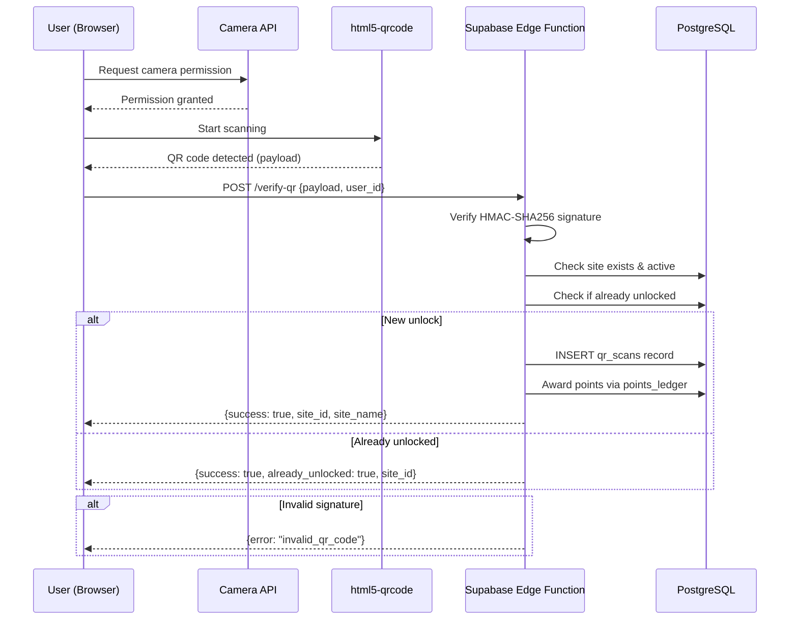
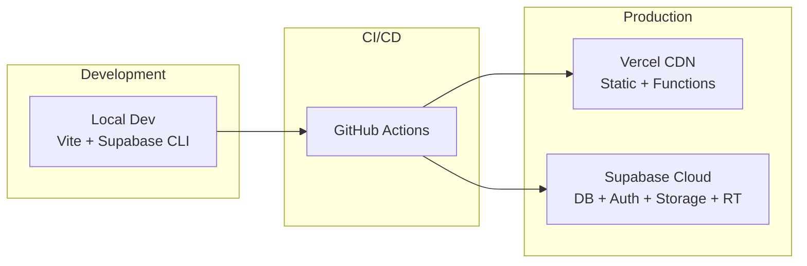
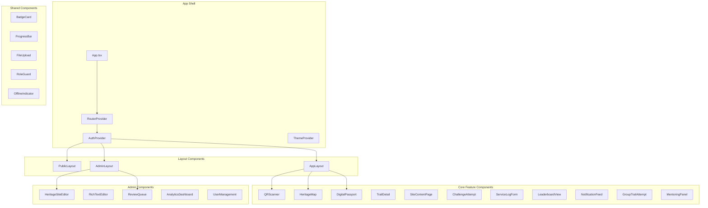
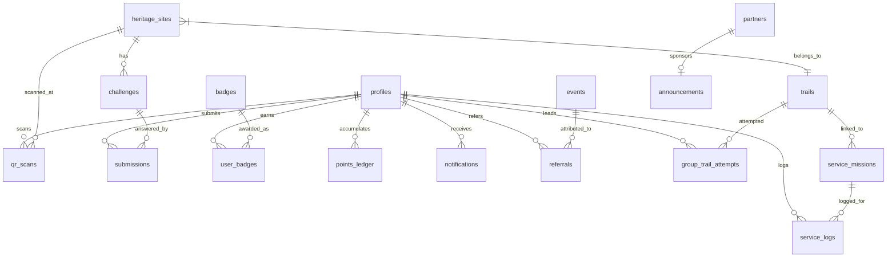

# Design Document: ScoutChase Taguig

## Overview

ScoutChase Taguig is a Progressive Web Application (PWA) that gamifies heritage exploration and community service for the Boy Scouts of the Philippines – Taguig City Council. The system combines location-based QR code scanning, educational content delivery, challenge completion, service hour tracking, and badge/leaderboard mechanics into a single mobile-first platform.

The architecture follows a client-heavy approach: a React + TypeScript SPA handles routing, state management, UI rendering, and in-browser QR scanning, while Supabase provides the full backend stack (Postgres database, Auth, Storage, Realtime subscriptions, and Edge Functions). The frontend deploys to Vercel as a static site with serverless functions for QR signature verification.

### Key Design Decisions

| Decision | Rationale |
|----------|-----------|
| React + TypeScript PWA | Mobile-first requirement (Req 19), offline access, installability, strong typing for complex role logic |
| Supabase backend | Integrated Auth, RLS for RBAC (Req 3), Realtime for leaderboards (Req 11), Storage for media, Edge Functions for QR verification |
| Leaflet maps (not Google Maps) | Free, open-source, no API key billing concerns for a non-profit council project |
| In-browser QR scanning (html5-qrcode) | No native app needed, works across mobile browsers, aligns with PWA approach |
| Vercel hosting | Free tier sufficient for initial deployment, edge network for fast global loads, serverless functions for HMAC verification |
| HMAC-SHA256 QR signing | Prevents QR spoofing (Req 21.1), server-side verification ensures integrity |
| Environment-based multi-council config | Replicability requirement (Req 22.1) without code changes |

---

## Architecture

### High-Level Architecture Diagram



### Data Flow: QR Scan Verification



### Deployment Architecture



### Technology Stack

| Layer | Technology | Version |
|-------|-----------|---------|
| Frontend Framework | React | 18.x |
| Language | TypeScript | 5.x |
| Build Tool | Vite | 5.x |
| Routing | React Router | 6.x |
| State Management | Zustand | 4.x |
| UI Components | Tailwind CSS + shadcn/ui | 3.x / latest |
| Maps | Leaflet + react-leaflet | 1.9.x / 4.x |
| QR Scanning | html5-qrcode | 2.x |
| Backend | Supabase | latest |
| Database | PostgreSQL (via Supabase) | 15.x |
| Auth | Supabase Auth | latest |
| Storage | Supabase Storage | latest |
| Realtime | Supabase Realtime | latest |
| Hosting | Vercel | — |
| PWA | vite-plugin-pwa (Workbox) | latest |
| Testing | Vitest + fast-check | latest |

---

## Components and Interfaces

### Page/Route Map

```
/                           → Landing page (public)
/login                      → Login page
/register                   → Registration form
/reset-password             → Password reset request
/join-scouting              → Public recruitment page (Req 12.1)
/partners                   → Public partners page (Req 13.1)

/app                        → Authenticated layout wrapper
/app/passport               → Digital Passport (Req 4)
/app/map                    → Interactive Heritage Map (Req 5)
/app/scan                   → QR Scanner (Req 6)
/app/trails                 → Trail listing
/app/trails/:trailId        → Trail detail + progress
/app/sites/:siteId          → Heritage Site content page (Req 7)
/app/challenges/:challengeId → Challenge attempt
/app/service                → Service missions listing
/app/service/log            → Log service hours form
/app/leaderboard            → Leaderboards (Req 11.4)
/app/badges                 → Badge collection
/app/notifications          → Notification feed (Req 16)
/app/group-trails           → Group trail attempts (Req 17)
/app/group-trails/:attemptId → Group trail detail
/app/mentoring              → Rover Scout mentoring panel (Req 18)
/app/events                 → Events listing
/app/referral               → Referral link & stats

/admin                      → Admin layout wrapper
/admin/dashboard            → Analytics dashboard (Req 15)
/admin/sites                → Heritage Sites CRUD
/admin/sites/:siteId/edit   → Site content editor (Req 14.1)
/admin/trails               → Trails management (Req 14.2)
/admin/challenges           → Challenges management (Req 14.3)
/admin/missions             → Service Missions management (Req 14.4)
/admin/badges               → Badges management (Req 14.5)
/admin/users                → User management (Req 14.6)
/admin/announcements        → Announcements (Req 14.7)
/admin/partners             → Partners management (Req 13.2)
/admin/events               → Events management (Req 12.5)
/admin/review-queue         → Submission & Service Log review
/admin/qr-codes             → QR code generation & management (Req 23)
/admin/export               → Data export (Req 15.3)
```

### Component Architecture



### Key Component Interfaces

```typescript
// Auth & Role Guard
interface RoleGuardProps {
  allowedRoles: UserRole[];
  children: React.ReactNode;
  fallback?: React.ReactNode;
}

type UserRole = 
  | 'Guest' 
  | 'Cub_Scout' 
  | 'Boy_Scout' 
  | 'Senior_Scout' 
  | 'Rover_Scout' 
  | 'Adult_Leader' 
  | 'Council_Admin';

// QR Scanner
interface QRScannerProps {
  onScanSuccess: (result: QRVerifyResponse) => void;
  onScanError: (error: ScanError) => void;
  timeoutMs?: number; // default 30000
}

interface QRVerifyResponse {
  success: boolean;
  site_id?: string;
  site_name?: string;
  already_unlocked?: boolean;
  error?: string;
}

// Heritage Map
interface HeritageMapProps {
  sites: HeritageSiteMarker[];
  selectedTrailFilter?: string;
  userUnlockedSiteIds: string[];
  onMarkerClick: (siteId: string) => void;
}

interface HeritageSiteMarker {
  id: string;
  name: string;
  lat: number;
  lng: number;
  trail_id: string;
  trail_name: string;
  is_unlocked: boolean;
  is_active: boolean;
}

// Challenge Attempt
interface ChallengeAttemptProps {
  challenge: Challenge;
  userRole: UserRole;
  attemptsRemaining: number;
  onSubmit: (response: ChallengeResponse) => Promise<SubmissionResult>;
}

type ChallengeType = 
  | 'trivia_quiz' 
  | 'observation' 
  | 'photo_documentation' 
  | 'puzzle' 
  | 'reflection_journal' 
  | 'interview' 
  | 'storytelling';

// Rich Text Editor (Admin)
interface RichTextEditorProps {
  initialContent: RichTextJSON;
  maxCharacters: number;
  onSave: (content: RichTextJSON) => Promise<void>;
  onPreview: (content: RichTextJSON) => void;
}

// Service Log
interface ServiceLogFormProps {
  availableMissions: ServiceMission[];
  onSubmit: (log: ServiceLogInput) => Promise<void>;
}

interface ServiceLogInput {
  description: string;      // 20-500 chars
  duration_hours: number;   // 0.5-24 in 0.5 increments
  date_performed: string;   // ISO date, not future
  photo_proof?: File;       // JPEG/PNG, max 5MB
  mission_id: string;
}

// Notification Feed
interface NotificationFeedProps {
  notifications: Notification[];
  unreadCount: number;
  onMarkRead: (notificationId: string) => void;
  onMarkAllRead: () => void;
}

// Leaderboard
interface LeaderboardViewProps {
  category: 'individual' | 'patrol_troop' | 'school' | 'rover_senior';
  entries: LeaderboardEntry[];
  currentUserRank?: number;
}
```

### Supabase Edge Functions

| Function | Purpose | Trigger |
|----------|---------|---------|
| `verify-qr-scan` | Validate HMAC signature, unlock site, award points | POST from scanner |
| `generate-qr-code` | Create HMAC-signed QR payload, generate PNG | Admin action |
| `regenerate-qr-code` | Invalidate old + create new signed QR | Admin action |
| `generate-certificate` | Create badge certificate PNG/PDF | User request |
| `process-referral` | Attribute registration to referral link | Registration hook |
| `check-badge-criteria` | Evaluate if user meets badge criteria after point/action events | Database trigger |
| `export-analytics-csv` | Generate CSV from analytics query | Admin request |

### Supabase Database Functions (RPC)

| Function | Purpose |
|----------|---------|
| `get_leaderboard(category, limit, offset)` | Ranked leaderboard query with tie-breaking |
| `get_user_passport(user_id)` | Aggregated passport data (sites, badges, points, rank) |
| `get_trail_progress(user_id, trail_id)` | Trail completion percentage |
| `get_analytics_summary(start_date, end_date)` | Aggregated analytics metrics |
| `award_points(user_id, amount, reason, ref_id)` | Atomic point award with ledger entry |
| `complete_trail_check(user_id, trail_id)` | Check & award trail completion bonus |

---

## Data Models

### Entity Relationship Diagram



### Database Schema

```sql
-- Enum types
CREATE TYPE user_role AS ENUM (
  'Guest', 'Cub_Scout', 'Boy_Scout', 'Senior_Scout', 
  'Rover_Scout', 'Adult_Leader', 'Council_Admin'
);

CREATE TYPE challenge_type AS ENUM (
  'trivia_quiz', 'observation', 'photo_documentation', 
  'puzzle', 'reflection_journal', 'interview', 'storytelling'
);

CREATE TYPE difficulty_level AS ENUM ('Easy', 'Medium', 'Hard');

CREATE TYPE submission_status AS ENUM ('pending', 'approved', 'rejected', 'failed');

CREATE TYPE service_log_status AS ENUM ('pending_verification', 'verified', 'rejected');

CREATE TYPE group_attempt_status AS ENUM ('active', 'completed', 'cancelled');

CREATE TYPE invitation_status AS ENUM ('pending', 'accepted', 'declined', 'expired');

-- Core tables

CREATE TABLE profiles (
  id UUID PRIMARY KEY REFERENCES auth.users(id) ON DELETE CASCADE,
  full_name TEXT NOT NULL CHECK (char_length(full_name) BETWEEN 2 AND 100),
  display_name TEXT CHECK (char_length(display_name) BETWEEN 3 AND 30),
  age INTEGER NOT NULL CHECK (age BETWEEN 7 AND 99),
  role user_role NOT NULL DEFAULT 'Guest',
  scout_section TEXT,
  troop_unit_number TEXT CHECK (troop_unit_number ~ '^[a-zA-Z0-9]{1,20}$'),
  school TEXT,
  avatar_url TEXT,
  guardian_email TEXT,
  council_id UUID,
  is_minor BOOLEAN GENERATED ALWAYS AS (age < 13) STORED,
  total_points INTEGER NOT NULL DEFAULT 0,
  total_service_hours NUMERIC(6,1) NOT NULL DEFAULT 0.0,
  created_at TIMESTAMPTZ NOT NULL DEFAULT now(),
  updated_at TIMESTAMPTZ NOT NULL DEFAULT now()
);

CREATE TABLE heritage_sites (
  id UUID PRIMARY KEY DEFAULT gen_random_uuid(),
  name TEXT NOT NULL,
  description TEXT CHECK (char_length(description) <= 2000),
  content_json JSONB, -- rich-text JSON, max 500,000 chars serialized
  latitude NUMERIC(10, 7) NOT NULL,
  longitude NUMERIC(10, 7) NOT NULL,
  trail_id UUID REFERENCES trails(id),
  photo_gallery TEXT[] DEFAULT '{}', -- Storage URLs, 1-10 images
  audio_url TEXT,
  video_url TEXT,
  timeline JSONB DEFAULT '[]', -- array of {year, event} objects, 1-20 entries
  qr_code_payload TEXT UNIQUE, -- HMAC-signed payload
  qr_code_image_url TEXT, -- Storage URL to generated PNG
  is_active BOOLEAN NOT NULL DEFAULT true,
  created_at TIMESTAMPTZ NOT NULL DEFAULT now(),
  updated_at TIMESTAMPTZ NOT NULL DEFAULT now()
);

CREATE TABLE trails (
  id UUID PRIMARY KEY DEFAULT gen_random_uuid(),
  name TEXT NOT NULL,
  theme TEXT NOT NULL,
  description TEXT CHECK (char_length(description) <= 500),
  site_count INTEGER NOT NULL DEFAULT 0,
  bonus_points INTEGER NOT NULL DEFAULT 50,
  is_active BOOLEAN NOT NULL DEFAULT true,
  created_at TIMESTAMPTZ NOT NULL DEFAULT now(),
  updated_at TIMESTAMPTZ NOT NULL DEFAULT now()
);

CREATE TABLE challenges (
  id UUID PRIMARY KEY DEFAULT gen_random_uuid(),
  heritage_site_id UUID NOT NULL REFERENCES heritage_sites(id) ON DELETE CASCADE,
  type challenge_type NOT NULL,
  difficulty difficulty_level NOT NULL DEFAULT 'Medium',
  title TEXT NOT NULL,
  description TEXT,
  content_json JSONB NOT NULL, -- quiz questions, prompts, etc.
  points_reward INTEGER NOT NULL DEFAULT 50,
  max_attempts INTEGER NOT NULL DEFAULT 3,
  created_at TIMESTAMPTZ NOT NULL DEFAULT now(),
  updated_at TIMESTAMPTZ NOT NULL DEFAULT now()
);

CREATE TABLE submissions (
  id UUID PRIMARY KEY DEFAULT gen_random_uuid(),
  user_id UUID NOT NULL REFERENCES profiles(id) ON DELETE CASCADE,
  challenge_id UUID NOT NULL REFERENCES challenges(id) ON DELETE CASCADE,
  response_json JSONB NOT NULL, -- user's answers/uploads
  photo_url TEXT,
  status submission_status NOT NULL DEFAULT 'pending',
  reviewer_id UUID REFERENCES profiles(id),
  reviewer_feedback TEXT CHECK (char_length(reviewer_feedback) >= 10),
  attempt_number INTEGER NOT NULL DEFAULT 1,
  points_awarded INTEGER DEFAULT 0,
  created_at TIMESTAMPTZ NOT NULL DEFAULT now(),
  reviewed_at TIMESTAMPTZ
);

CREATE TABLE service_missions (
  id UUID PRIMARY KEY DEFAULT gen_random_uuid(),
  trail_id UUID NOT NULL REFERENCES trails(id) ON DELETE CASCADE,
  name TEXT NOT NULL,
  description TEXT,
  mission_type TEXT NOT NULL, -- clean_up, tree_planting, waste_segregation, etc.
  is_active BOOLEAN NOT NULL DEFAULT true,
  created_at TIMESTAMPTZ NOT NULL DEFAULT now()
);

CREATE TABLE service_logs (
  id UUID PRIMARY KEY DEFAULT gen_random_uuid(),
  user_id UUID NOT NULL REFERENCES profiles(id) ON DELETE CASCADE,
  mission_id UUID NOT NULL REFERENCES service_missions(id),
  description TEXT NOT NULL CHECK (char_length(description) BETWEEN 20 AND 500),
  duration_hours NUMERIC(4,1) NOT NULL CHECK (duration_hours BETWEEN 0.5 AND 24),
  date_performed DATE NOT NULL CHECK (date_performed <= CURRENT_DATE),
  photo_url TEXT,
  status service_log_status NOT NULL DEFAULT 'pending_verification',
  verifier_id UUID REFERENCES profiles(id),
  rejection_reason TEXT CHECK (char_length(rejection_reason) >= 10),
  attempt_number INTEGER NOT NULL DEFAULT 1,
  max_attempts INTEGER NOT NULL DEFAULT 3,
  created_at TIMESTAMPTZ NOT NULL DEFAULT now(),
  verified_at TIMESTAMPTZ
);

CREATE TABLE badges (
  id UUID PRIMARY KEY DEFAULT gen_random_uuid(),
  name TEXT NOT NULL UNIQUE,
  description TEXT,
  criteria_json JSONB NOT NULL, -- machine-readable criteria definition
  icon_url TEXT NOT NULL,
  category TEXT,
  created_at TIMESTAMPTZ NOT NULL DEFAULT now()
);

CREATE TABLE user_badges (
  id UUID PRIMARY KEY DEFAULT gen_random_uuid(),
  user_id UUID NOT NULL REFERENCES profiles(id) ON DELETE CASCADE,
  badge_id UUID NOT NULL REFERENCES badges(id) ON DELETE CASCADE,
  earned_at TIMESTAMPTZ NOT NULL DEFAULT now(),
  certificate_url TEXT,
  UNIQUE(user_id, badge_id)
);

CREATE TABLE points_ledger (
  id UUID PRIMARY KEY DEFAULT gen_random_uuid(),
  user_id UUID NOT NULL REFERENCES profiles(id) ON DELETE CASCADE,
  amount INTEGER NOT NULL,
  reason TEXT NOT NULL, -- 'challenge_complete', 'service_hours', 'trail_complete', 'event'
  reference_id UUID, -- FK to related entity
  created_at TIMESTAMPTZ NOT NULL DEFAULT now()
);

CREATE TABLE partners (
  id UUID PRIMARY KEY DEFAULT gen_random_uuid(),
  name TEXT NOT NULL,
  description TEXT CHECK (char_length(description) <= 200),
  logo_url TEXT NOT NULL,
  is_active BOOLEAN NOT NULL DEFAULT true,
  created_at TIMESTAMPTZ NOT NULL DEFAULT now(),
  updated_at TIMESTAMPTZ NOT NULL DEFAULT now()
);

CREATE TABLE announcements (
  id UUID PRIMARY KEY DEFAULT gen_random_uuid(),
  title TEXT NOT NULL,
  content TEXT NOT NULL CHECK (char_length(content) <= 2000),
  author_id UUID NOT NULL REFERENCES profiles(id),
  target_roles user_role[] DEFAULT '{}'::user_role[],
  is_published BOOLEAN NOT NULL DEFAULT false,
  published_at TIMESTAMPTZ,
  created_at TIMESTAMPTZ NOT NULL DEFAULT now()
);

CREATE TABLE qr_scans (
  id UUID PRIMARY KEY DEFAULT gen_random_uuid(),
  user_id UUID NOT NULL REFERENCES profiles(id) ON DELETE CASCADE,
  heritage_site_id UUID NOT NULL REFERENCES heritage_sites(id),
  scanned_at TIMESTAMPTZ NOT NULL DEFAULT now(),
  UNIQUE(user_id, heritage_site_id)
);

CREATE TABLE notifications (
  id UUID PRIMARY KEY DEFAULT gen_random_uuid(),
  user_id UUID NOT NULL REFERENCES profiles(id) ON DELETE CASCADE,
  title TEXT NOT NULL,
  body TEXT NOT NULL,
  type TEXT NOT NULL, -- 'announcement', 'submission_status', 'badge_earned', 'trail_launch', 'event'
  reference_id UUID,
  is_read BOOLEAN NOT NULL DEFAULT false,
  created_at TIMESTAMPTZ NOT NULL DEFAULT now()
);

CREATE TABLE group_trail_attempts (
  id UUID PRIMARY KEY DEFAULT gen_random_uuid(),
  trail_id UUID NOT NULL REFERENCES trails(id),
  leader_id UUID NOT NULL REFERENCES profiles(id),
  status group_attempt_status NOT NULL DEFAULT 'active',
  created_at TIMESTAMPTZ NOT NULL DEFAULT now(),
  completed_at TIMESTAMPTZ
);

CREATE TABLE group_trail_members (
  id UUID PRIMARY KEY DEFAULT gen_random_uuid(),
  attempt_id UUID NOT NULL REFERENCES group_trail_attempts(id) ON DELETE CASCADE,
  user_id UUID NOT NULL REFERENCES profiles(id),
  invitation_status invitation_status NOT NULL DEFAULT 'pending',
  invited_at TIMESTAMPTZ NOT NULL DEFAULT now(),
  responded_at TIMESTAMPTZ,
  UNIQUE(attempt_id, user_id)
);

CREATE TABLE referrals (
  id UUID PRIMARY KEY DEFAULT gen_random_uuid(),
  referrer_id UUID NOT NULL REFERENCES profiles(id),
  referred_user_id UUID REFERENCES profiles(id),
  referral_code TEXT NOT NULL UNIQUE,
  event_id UUID REFERENCES events(id),
  created_at TIMESTAMPTZ NOT NULL DEFAULT now(),
  redeemed_at TIMESTAMPTZ,
  expires_at TIMESTAMPTZ NOT NULL DEFAULT (now() + interval '90 days')
);

CREATE TABLE events (
  id UUID PRIMARY KEY DEFAULT gen_random_uuid(),
  name TEXT NOT NULL,
  description TEXT,
  event_date TIMESTAMPTZ NOT NULL,
  location TEXT,
  max_participants INTEGER,
  created_by UUID NOT NULL REFERENCES profiles(id),
  participant_count INTEGER NOT NULL DEFAULT 0,
  challenge_completions INTEGER NOT NULL DEFAULT 0,
  new_registrations INTEGER NOT NULL DEFAULT 0,
  is_active BOOLEAN NOT NULL DEFAULT true,
  created_at TIMESTAMPTZ NOT NULL DEFAULT now()
);

-- Indexes for performance
CREATE INDEX idx_profiles_role ON profiles(role);
CREATE INDEX idx_profiles_council ON profiles(council_id);
CREATE INDEX idx_profiles_troop ON profiles(troop_unit_number);
CREATE INDEX idx_heritage_sites_trail ON heritage_sites(trail_id);
CREATE INDEX idx_heritage_sites_active ON heritage_sites(is_active);
CREATE INDEX idx_qr_scans_user ON qr_scans(user_id);
CREATE INDEX idx_qr_scans_site ON qr_scans(heritage_site_id);
CREATE INDEX idx_submissions_user ON submissions(user_id);
CREATE INDEX idx_submissions_status ON submissions(status);
CREATE INDEX idx_service_logs_user ON service_logs(user_id);
CREATE INDEX idx_service_logs_status ON service_logs(status);
CREATE INDEX idx_points_ledger_user ON points_ledger(user_id);
CREATE INDEX idx_points_ledger_created ON points_ledger(created_at);
CREATE INDEX idx_notifications_user_unread ON notifications(user_id, is_read);
CREATE INDEX idx_group_trail_members_user ON group_trail_members(user_id);
CREATE INDEX idx_referrals_code ON referrals(referral_code);
CREATE INDEX idx_announcements_published ON announcements(is_published, published_at);
```


## Correctness Properties

*A property is a characteristic or behavior that should hold true across all valid executions of a system—essentially, a formal statement about what the system should do. Properties serve as the bridge between human-readable specifications and machine-verifiable correctness guarantees.*

### Property 1: Registration input validation

*For any* registration input with a full name, age, scout section, and optional troop/unit number, the validation function SHALL accept the input if and only if the name is between 2 and 100 characters, age is between 7 and 99, section is one of the allowed values, and if a troop/unit number is provided it matches `^[a-zA-Z0-9]{1,20}$`.

**Validates: Requirements 1.1**

### Property 2: Role assignment from registration

*For any* registration with a scout section selection and optional troop/unit number, the assigned role SHALL be: (a) the corresponding scout role if the section is a scout section AND a valid troop/unit number is provided, (b) `Adult_Leader` if "Adult Leader" is selected, (c) `Guest` if "Not a Scout yet" is selected, or (d) `Guest` if a scout section is selected but no troop/unit number is provided. Additionally, for any age < 12, guardian_email SHALL be required.

**Validates: Requirements 1.2, 1.3, 1.4, 1.5, 1.6**

### Property 3: RBAC access decision correctness

*For any* pair of (user role, protected resource), the access control function SHALL return `allow` if and only if the role appears in the resource's permission set, and `deny` (403) otherwise.

**Validates: Requirements 3.1, 3.9**

### Property 4: Cub Scout difficulty filtering

*For any* set of challenges with mixed difficulty levels, filtering challenges for the `Cub_Scout` role SHALL return only challenges with difficulty = 'Easy', and the result set SHALL be a subset of the input.

**Validates: Requirements 3.3**

### Property 5: Digital Passport aggregation correctness

*For any* set of user activity records (QR scans, approved submissions, verified service logs, earned badges, points ledger entries), the passport aggregation function SHALL produce counts and totals that exactly match the sum/count of the corresponding records.

**Validates: Requirements 4.1**

### Property 6: Display name validation

*For any* string, the display name validator SHALL accept it if and only if its length is between 3 and 30 characters and it contains only letters, numbers, spaces, and hyphens.

**Validates: Requirements 4.3, 4.4**

### Property 7: Map theme filtering

*For any* set of heritage sites with various trail themes and a selected theme filter, the filtered result SHALL contain only sites whose trail theme matches the filter, and SHALL return an empty set (not an error) when no sites match.

**Validates: Requirements 5.3**

### Property 8: QR code HMAC round-trip

*For any* heritage site identifier, signing it with HMAC-SHA256 using the server secret and then verifying the resulting payload SHALL always succeed. Conversely, *for any* payload where even a single byte is modified after signing, verification SHALL always fail.

**Validates: Requirements 6.3, 21.1**

### Property 9: QR scan idempotency

*For any* user who has already scanned a heritage site, performing a second scan of the same site SHALL NOT create a duplicate `qr_scans` record and SHALL NOT change the user's total points.

**Validates: Requirements 6.8, 21.6**

### Property 10: Scan log completeness

*For any* successful QR scan event, the created log record SHALL contain a non-null timestamp, user_id, and heritage_site_id.

**Validates: Requirements 6.7**

### Property 11: File upload validation

*For any* file metadata (MIME type, file size in bytes, and dimensions in pixels), the upload validator SHALL accept the file if and only if the type is in the allowed set (JPEG, PNG, or WebP where applicable), size does not exceed the configured limit (2MB for avatars, 5MB for challenge photos and service log proofs), and dimensions meet minimum requirements where specified (512×512 max for avatars, 480×480 min for challenge photos).

**Validates: Requirements 4.5, 9.5, 9.6, 21.4**

### Property 12: Quiz scoring correctness

*For any* set of quiz answers and a corresponding answer key, the computed score SHALL equal the count of answers that match the key multiplied by the points-per-question value.

**Validates: Requirements 9.7**

### Property 13: Review attempt limiting

*For any* reviewable item (Submission or Service Log) with an `attempt_number` and `max_attempts`, rejection SHALL allow resubmission if `attempt_number < max_attempts`, and SHALL mark the item as "failed"/"rejected" and prevent further submissions if `attempt_number >= max_attempts`.

**Validates: Requirements 9.9, 9.10, 10.5, 10.6**

### Property 14: Service log input validation

*For any* service log input, the validator SHALL accept if and only if description is between 20 and 500 characters, duration is between 0.5 and 24 hours in 0.5-hour increments, date_performed is not in the future, and if a photo is provided it passes the file upload validation rules.

**Validates: Requirements 10.2**

### Property 15: Service hour point award calculation

*For any* verified service log with duration D hours, the points awarded SHALL equal `floor(D) * 10 + (if fractional part >= 0.5 then 5 else 0)` (i.e., 10 points per verified hour), subject to a maximum of 500 points per calendar month per user.

**Validates: Requirements 10.4, 11.1**

### Property 16: Point system calculation

*For any* combination of completed challenges, verified service hours, completed trails, and attended events, the total points SHALL equal: `(challenges_completed × 50) + (service_points capped at 500/month) + (trails_completed × 100) + (events_attended × 25)`.

**Validates: Requirements 11.1**

### Property 17: Badge criteria evaluation

*For any* user activity profile (site visits, challenge completions by category, verified service hours, total points, referral count, trail completions), the badge evaluator SHALL award a badge if and only if the user's stats meet or exceed every criterion defined in the badge's `criteria_json`.

**Validates: Requirements 11.2**

### Property 18: Leaderboard ordering

*For any* set of users with points and last-point-earned timestamps, the leaderboard SHALL be sorted in descending order by total points, with ties broken by the earlier (smaller) `last_point_date`. The result SHALL contain at most 100 entries.

**Validates: Requirements 11.4**

### Property 19: Minor privacy protection

*For any* public leaderboard output, no entry for a user whose `is_minor = true` (age < 13) SHALL reveal personally identifiable information beyond a display name.

**Validates: Requirements 21.7**

### Property 20: Partners alphabetical ordering

*For any* set of active partners, the public partners list SHALL be sorted in ascending alphabetical order by organization name (case-insensitive).

**Validates: Requirements 13.1**

### Property 21: Trail site count validation

*For any* trail creation or update operation with an assigned site list, the validator SHALL accept if the list contains between 2 and 30 sites (inclusive) and reject otherwise.

**Validates: Requirements 8.4, 8.5**

### Property 22: Group trail attempt size validation

*For any* group trail creation with N invitees, the validator SHALL accept if 1 ≤ N ≤ 9 (total group size including leader is 2–10) and reject otherwise.

**Validates: Requirements 17.1**

### Property 23: Group trail progress and completion

*For any* group trail attempt with M members and a trail of N sites, the group progress percentage SHALL equal `|union of all member unlocks| / N × 100`. The attempt SHALL be marked complete if and only if the union of all member unlocks covers all N sites in the trail.

**Validates: Requirements 17.4, 17.5**

### Property 24: Rover Scout moderation scope

*For any* submission in the review queue, a Rover_Scout SHALL be permitted to moderate it if and only if the submission's author has role `Cub_Scout` or `Boy_Scout`.

**Validates: Requirements 18.3, 18.4**

### Property 25: Rich-text content round-trip

*For any* valid rich-text JSON document, parsing it to HTML and then converting that HTML back to rich-text JSON SHALL produce a structurally identical document (same element types, same nesting, same text content, same attributes).

**Validates: Requirements 24.1, 24.2, 24.3, 24.4**

### Property 26: HTML sanitization removes all executable content

*For any* HTML string (including strings containing `<script>` tags, `on*` event handler attributes, `javascript:` URLs, or other executable constructs), the sanitizer output SHALL contain none of these executable elements while preserving safe text content and allowed structural elements.

**Validates: Requirements 21.3, 24.5**

### Property 27: Content size validation

*For any* rich-text JSON content string, the validator SHALL accept content with serialized length ≤ 500,000 characters and reject content exceeding this limit.

**Validates: Requirements 24.7**

---

## Error Handling

### Error Handling Strategy

| Error Category | Handling Approach | User Experience |
|----------------|-------------------|-----------------|
| Network failure | Retry with exponential backoff (3 attempts) | Toast notification with retry button |
| Auth failure | Clear session, redirect to login | "Session expired" message |
| Validation error | Return field-specific errors | Inline error messages per field |
| File upload failure | Client-side pre-validation + server rejection | Specific constraint violation message |
| QR scan failure | Signature/site check with specific error codes | Contextual error with retry option |
| Database constraint violation | Catch Postgres error codes, map to user messages | Generic "operation failed" with retry |
| Rate limiting | 429 response with Retry-After header | "Too many attempts" with countdown |
| Offline access | Service worker cache-first strategy | Offline indicator + cached content |
| Media load failure | Fallback placeholder + retry | "Content unavailable" with remaining content visible |

### Error Response Format

```typescript
interface AppError {
  code: string;           // machine-readable error code
  message: string;        // user-facing message
  field?: string;         // for validation errors
  retryable: boolean;     // whether retry might succeed
  retryAfterMs?: number;  // suggested retry delay
}

interface ValidationResult {
  valid: boolean;
  errors: AppError[];
}
```

### Critical Error Flows

1. **QR Scan Errors**: Invalid signature → "This QR code is invalid or has been tampered with." Inactive site → "This heritage site is currently inactive." Already scanned → Navigate to content (no error).

2. **Submission/Service Log Rejection**: Include reviewer reason (min 10 chars), show remaining attempts, disable resubmit at max attempts.

3. **Offline Scenarios**: Cache heritage site text + images via Service Worker. Scanner requires network (HMAC verification is server-side). Queue notifications for delivery on reconnect.

4. **Admin Content Operations**: Dependency warnings before deletion (Req 14.8). Success/failure confirmation within 3 seconds (Req 14.9).

---

## Testing Strategy

### Testing Layers

| Layer | Tool | Purpose |
|-------|------|---------|
| Unit Tests | Vitest | Pure functions, validation logic, state management |
| Property Tests | Vitest + fast-check | Universal properties (27 properties above) |
| Component Tests | Vitest + React Testing Library | Component rendering and interaction |
| Integration Tests | Vitest + Supabase local | Database queries, RLS policies, Edge Functions |
| E2E Tests | Playwright | Critical user flows (registration, QR scan, challenge completion) |
| Accessibility | axe-core + Playwright | WCAG 2.1 AA compliance |
| Performance | Lighthouse CI | LCP < 3s, PWA audit |

### Property-Based Testing Configuration

- **Library**: fast-check (TypeScript property-based testing library)
- **Minimum iterations**: 100 per property test
- **Tag format**: `Feature: scoutchase-taguig, Property {N}: {title}`

Each of the 27 correctness properties maps to a single property-based test. Properties test pure logic functions extracted from the application:

| Property | Module Under Test |
|----------|-------------------|
| 1 (Registration validation) | `lib/validators/registration.ts` |
| 2 (Role assignment) | `lib/auth/role-assignment.ts` |
| 3 (RBAC access) | `lib/auth/permissions.ts` |
| 4 (Difficulty filtering) | `lib/challenges/filter.ts` |
| 5 (Passport aggregation) | `lib/passport/aggregate.ts` |
| 6 (Display name validation) | `lib/validators/display-name.ts` |
| 7 (Map filtering) | `lib/map/filter-sites.ts` |
| 8 (HMAC round-trip) | `lib/qr/hmac.ts` |
| 9 (Scan idempotency) | `lib/qr/scan-handler.ts` |
| 10 (Scan log completeness) | `lib/qr/scan-handler.ts` |
| 11 (File upload validation) | `lib/validators/file-upload.ts` |
| 12 (Quiz scoring) | `lib/challenges/quiz-scorer.ts` |
| 13 (Review attempt limiting) | `lib/review/attempt-limiter.ts` |
| 14 (Service log validation) | `lib/validators/service-log.ts` |
| 15 (Service hour points) | `lib/points/service-points.ts` |
| 16 (Point system) | `lib/points/calculator.ts` |
| 17 (Badge criteria) | `lib/badges/evaluator.ts` |
| 18 (Leaderboard ordering) | `lib/leaderboard/sort.ts` |
| 19 (Minor privacy) | `lib/leaderboard/privacy-filter.ts` |
| 20 (Partners ordering) | `lib/partners/sort.ts` |
| 21 (Trail site count) | `lib/validators/trail.ts` |
| 22 (Group trail size) | `lib/validators/group-trail.ts` |
| 23 (Group trail progress) | `lib/trails/group-progress.ts` |
| 24 (Rover moderation scope) | `lib/review/moderation-scope.ts` |
| 25 (Rich-text round-trip) | `lib/content/rich-text-parser.ts` |
| 26 (HTML sanitization) | `lib/content/sanitizer.ts` |
| 27 (Content size validation) | `lib/validators/content-size.ts` |

### Unit Test Focus Areas

- Specific examples for role-based UI rendering (each role sees correct navigation items)
- Edge cases for age boundaries (7, 11, 12, 13, 99)
- Guardian email requirement trigger at age < 12
- Account lockout at exactly 5 failed attempts
- Referral attribution when multiple sources exist
- Invitation expiry at 72-hour boundary
- Monthly service point cap (500 points)

### Integration Test Focus Areas

- Supabase Auth flow (registration, login, session management)
- RLS policy enforcement (each role can only access permitted rows)
- Realtime subscription updates (leaderboard, passport)
- Edge Function invocations (QR verify, certificate generation)
- File storage upload/retrieval with access policies

### E2E Critical Paths

1. Guest → Register → Complete introductory challenge → See recruitment prompt
2. Scout → Login → Scan QR → View site content → Complete challenge → Earn points
3. Scout → Complete all trail sites → Trail completion → Badge award
4. Scout → Log service hours → Adult Leader verifies → Points awarded
5. Admin → Create site → Generate QR → Edit content → Publish
6. Senior Scout → Create group trail → Invite members → Complete together

### Visual Design Direction

**Theme: "Bold but Official"**

| Element | Specification |
|---------|---------------|
| Primary Color | BSP Forest Green `#1B5E20` |
| Secondary Color | Gold `#FFD700` |
| Accent 1 | Deep Red `#B71C1C` |
| Accent 2 | Navy `#1A237E` |
| Background | Off-white `#FAFAFA` |
| Card Background | White `#FFFFFF` with subtle shadow |
| Typography | Inter (body), Montserrat (headings) |
| Icon Style | Badge-shaped, expedition/compass motifs |
| Badge Design | Embroidered-patch-style with stitching border effect |
| Map Pins | Scout fleur-de-lis shaped, color-coded by trail theme |
| Illustrations | Compass rose, trail path lines, scout knot decorations |

### Security Design Summary

| Mechanism | Implementation |
|-----------|---------------|
| QR Code Signing | HMAC-SHA256 with 256-bit server secret stored in Supabase Vault |
| Auth | Supabase Auth with email/password, 24h sessions |
| RBAC Frontend | `<RoleGuard>` component wrapping protected routes |
| RBAC Backend | Supabase RLS policies on every table, role extracted from JWT |
| Input Sanitization | DOMPurify for HTML display, server-side text stripping before storage |
| File Validation | Client-side pre-check + server-side validation in Storage policies |
| Rate Limiting | Supabase Auth built-in (5 attempts/15 min lockout) |
| Minor Protection | `is_minor` computed column, leaderboard query excludes PII for minors |
| HTTPS | Enforced by Vercel + Supabase (TLS 1.3) |

